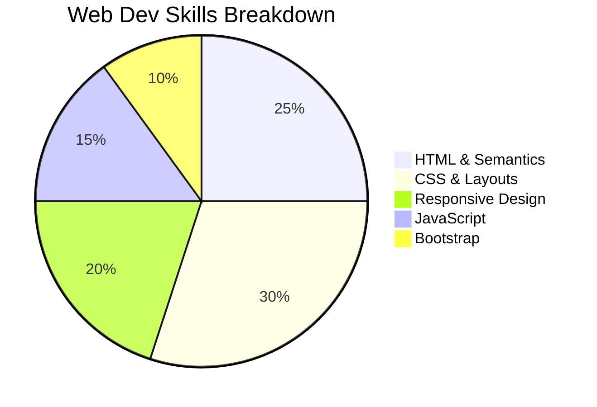

# 🌐 Web Development Essentials - Complete Learning Hub 🚀


Welcome to your ultimate web development learning repository! This interactive space is designed to transform beginners into confident web developers through hands-on examples, structured learning paths, and real-world projects.

## 🎯 What You'll Learn

| Skill Area       | Key Concepts                          | Example Projects                 |
|------------------|---------------------------------------|----------------------------------|
| **HTML5**        | Semantic markup, forms, accessibility | Personal portfolio page          |
| **CSS3**         | Flexbox, Grid, animations, variables  | Responsive product gallery       |
| **Bootstrap 5**  | Components, utilities, customization  | Admin dashboard UI               |
| **JavaScript**   | DOM manipulation, events, APIs        | Interactive todo application     |
| **Responsive**   | Media queries, mobile-first approach  | Restaurant website               |

## 📂 Repository Structure

```
web-dev-essentials/
├───📁 fundamentals/
│   ├───html/              # HTML examples with semantic structure
│   ├───css/               # Modern CSS techniques
│   └───js-basics/         # JavaScript fundamentals
│
├───📁 frameworks/
│   ├───bootstrap/         # Bootstrap layouts & components
│   └───tailwind/          # Coming soon!
│
├───📁 projects/           # Complete projects
└───📁 challenges/         # Bonus coding challenges
```

## 🛠️ Getting Started

1. **Clone the repo**:
   ```bash
   git clone https://github.com/your-username/web-dev-essentials.git
   ```
2. **Explore examples** - Each folder contains:
   - `index.html` (HTML structure)
   - `style.css` (Custom styling)
   - `script.js` (Interactive elements)
   - `README.md` (Specific instructions)

3. **Experiment freely** - Break things and learn!

## 📚 Comprehensive Learning Resources

### 🌐 Core Technologies
- [HTML5 - MDN Web Docs](https://developer.mozilla.org/en-US/docs/Web/HTML)
- [CSS3 - MDN Reference](https://developer.mozilla.org/en-US/docs/Web/CSS)
- [JavaScript - Modern Tutorial](https://javascript.info/)

### 🎓 Learning Platforms
| Platform | Description |
|----------|-------------|
| [freeCodeCamp](https://www.freecodecamp.org/) | Free interactive coding curriculum |
| [Frontend Masters](https://frontendmasters.com/) | In-depth video courses |
| [Scrimba](https://scrimba.com/) | Interactive coding screencasts |

### 🛠️ Essential Tools
- [CodePen](https://codepen.io/) - Online code editor
- [VS Code](https://code.visualstudio.com/) - Recommended editor
- [Chrome DevTools](https://developer.chrome.com/docs/devtools/) - Debugging tool

## 💡 Example File Structure

Each example includes proper resource linking:

```html
<!DOCTYPE html>
<html lang="en">
<head>
  <!-- CSS Resources -->
  <link rel="stylesheet" href="css/style.css">
  <!-- Bootstrap CDN -->
  <link href="https://cdn.jsdelivr.net/npm/bootstrap@5.3.0/dist/css/bootstrap.min.css" rel="stylesheet">
</head>
<body>
  
  <!-- Content goes here -->

  <!-- JavaScript Resources -->
  <script src="js/script.js"></script>
  <!-- Bootstrap JS Bundle -->
  <script src="https://cdn.jsdelivr.net/npm/bootstrap@5.3.0/dist/js/bootstrap.bundle.min.js"></script>
</body>
</html>
```

## 🏆 Skills You'll Master



## 🚀 Project Roadmap

1. **Week 1**: Build a semantic HTML document
2. **Week 2**: Style it with CSS Flexbox/Grid
3. **Week 3**: Make it responsive
4. **Week 4**: Add Bootstrap components
5. **Week 5**: Implement JavaScript interactivity

## 🤝 How to Contribute

We welcome improvements! Here's how:

1. Fork this repository
2. Create a branch (`git checkout -b improve-feature`)
3. Commit your changes (`git commit -m 'Add amazing feature'`)
4. Push to the branch (`git push origin improve-feature`)
5. Open a Pull Request

## 📣 Community & Support

Join our learning community:
- [Course Discussion Forum](#) (link your platform)
- [Discord Channel](#) (add your invite link)
- Weekly Q&A sessions (include schedule)

## 🌟 Pro Tips

> "The best way to learn is by building. Don't just read examples - modify them, break them, and rebuild them better!" - Anonymous Web Dev

Happy coding! May your `divs` always be properly nested and your JavaScript always pass linting! 🎉💻🔥


